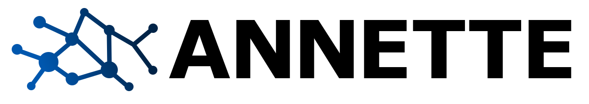
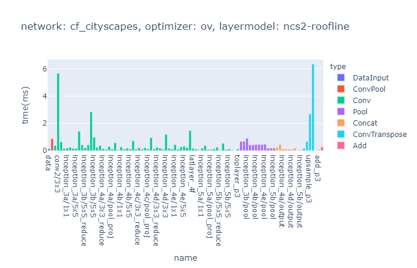

<div align="center">
  
</div>

## Accurate Neural Network Execution Time Estimation

Implementation of the ANNETTE Estimation Module <a href="https://ieeexplore.ieee.org/abstract/document/9306831/" target="_blank">Link to Paper</a>

ANNETTE (Accurate Neural Network Execution Time Estimation) is a framework designed to predict the execution time of Deep Neural Networks (DNNs) on hardware accelerators using a stacked modeling approach. It creates accurate estimations by combining mapping models and layer-wise estimation models derived from benchmarks. This allows for efficient design space exploration and hardware-specific neural architecture search, offering a significant tool for developers to estimate performance without extensive testing on actual hardware. The methodology demonstrates high accuracy and fidelity in predictions, making it a valuable asset for optimizing neural network deployment on diverse hardware platforms.

Cite: 

`M. Wess, M. Ivanov, C. Unger, A. Nookala, A. Wendt and A. Jantsch, "ANNETTE: Accurate Neural Network Execution Time Estimation With Stacked Models," in IEEE Access, vol. 9, pp. 3545-3556, 2021, doi: 10.1109/ACCESS.2020.3047259.`

# Install
* Tested with python >=3.6

recommended install:
- `git clone https://github.com/embedded-machine-learning/annette.git`
- `cd annette`
- recommended: `python -m venv .venv && source .venv/bin/activate`
- `pip install -r requirements.txt`
- `pip install -e .`
- `wget https://github.com/embedded-machine-learning/annette/releases/download/v0.1/models.zip`
- `unzip -o models.zip -d database`

# Usage
* mmtoir to export to MMDNN format (here you might need to install tensorflow or pytorch)
* ANNETTE only needs the .pb-file, you can savely remove the .npy-weightfile
* `annette_o2a` lets you convert .onnx models to the annette format

## Estimation
`annette_estimate [network-name] [mapping-model] [layer-model]`

## Results
* The results are store in `database/results/[layer-model]`
* Python functions return the total execution time in [ms] and a pandas dataframe with the layer-wise results
* Example visualization with plotly (`notebooks/sample_estimation.ipynb`)
</img>

## Benchmarking
* openvino example in `runs\run_openvino.py` (install openvino with `pip install openvino`)
* results stored to `database\benchmarks`

## MMDNN to ANNETTE
* use `annette_m2a [network-file/network-name]` to convert from mmdnn to annette format. Output is stored in `database/graphs/annette/[network].json`
* Either copy the file to `database/graphs/mmdnn/[network].pb` and use only the `network-name` oder give the full Path

## Examples

* Some example graphs are already stored in `database/graphs/annette`
* Some example notebooks are found in `notebooks/`
* Some model optimizer examples `ov` and `dnndk`
* Some layer model exmaples `ncs2-roofline` and `dnndk-roofline`
* For conversion and download MMDNN requires some of the frameworks such as pytorch, tensorflow

### Simple examples (networks in `database/graphs/annette`)

```
annette_m2a cf_resnet50 
annette_estimate cf_resnet50 ov ncs2-roofline
```

### Pytorch Mnasnet0.5
```
mmdownload -f pytorch -n mnasnet0_5 -o database/graphs/pytorch/
mmtoir -f pytorch -d database/graphs/mmdnn/mnasnet0_5 --inputShape 3,224,224 -n database/graphs/pytorch/imagenet_mnasnet0_5.pth
annette_m2a mnasnet0_5
annette_estimate mnasnet0_5 ov ncs2-roofline
```

### Pytorch Densenet121
```
mmdownload -f pytorch -n densenet121 -o database/graphs/pytorch/
mmtoir -f pytorch -d database/graphs/mmdnn/densenet121 --inputShape 3,224,224 -n database/graphs/pytorch/imagenet_densenet121.pth
annette_m2a densenet121 
annette_estimate densenet121 ov ncs2-roofline
```

### Pytorch Squeezenet1.0
```
mmdownload -f pytorch -n squeezenet1_0 -o database/graphs/pytorch/
mmtoir -f pytorch -d database/graphs/mmdnn/squeezenet1_0 --inputShape 3,224,224 -n database/graphs/pytorch/imagenet_squeezenet1_0.pth
annette_m2a squeezenet1_0 
annette_estimate squeezenet1_0 ov ncs2-roofline
```


### DeeplabV3 (https://github.com/tensorflow/models/blob/master/research/deeplab/g3doc/model_zoo.md)
```
mmtoir -f tensorflow -w database/graphs/tf/deeplabv3_mnv2_dm05_pascal.pb --inNodeName MobilenetV2/MobilenetV2/input --inputShape 513,513,3 --dstNodeName ArgMax -o database/graphs/mmdnn/deeplabv3
annette_m2a deeplabv3 
annette_estimate deeplabv3 ov ncs2-roofline
```

### Mobilenetv1
```
mmdownload -f tensorflow -n mobilenet_v1_1.0_frozen -o database/graphs/tf/
mmtoir -f tensorflow -w database/graphs/tf/mobilenet_v1_1.0_224/frozen_graph.pb --inNodeName input --inputShape 224,224,3 --dstNodeName MobilenetV1/Predictions/Softmax -o database/graphs/mmdnn/mobilenet_v1
annette_m2a mobilenet_v1
annette_estimate mobilenet_v1 ov ncs2-roofline
```

### TinyYolov4
```
mmtoir -f tensorflow -w database/graphs/tf/darknet_yolov4_tiny_512_512_coco.pb --inNodeName inputs --inputShape 512,512,3 --dstNodeName detector/yolo-v4-tiny/Conv_17/BiasAdd detector/yolo-v4-tiny/Conv_20/BiasAdd -o database/graphs/mmdnn/darknet_yolov4_tiny_512_512_coco
annette_m2a darknet_yolov4_tiny_512_512_coco
annette_estimate darknet_yolov4_tiny_512_512_coco ov ncs2-roofline
```

### Yolov4
```
mmtoir -f tensorflow -w database/graphs/tf/darknet_yolov4_512_512_coco.pb --inNodeName inputs --inputShape 512,512,3 --dstNodeName detector/yolo-v4/Conv_1/BiasAdd detector/yolo-v4/Conv_9/BiasAdd detector/yolo-v4/Conv_17/BiasAdd -o database/graphs/mmdnn/darknet_yolov4_512_512_coco
annette_m2a darknet_yolov4_512_512_coco
annette_estimate darknet_yolov4_512_512_coco ov ncs2-roofline
```


## Note
This project has been set up using PyScaffold 3.2.3. For details and usage
information on PyScaffold see https://pyscaffold.org/.