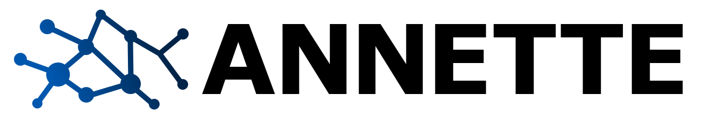

<div align="center">
  
</div>

## Accurate Neural Network Execution Time Estimation
Implementation of the ANNETTE Estimation Module [Link to Paper](https://ieeexplore.ieee.org/abstract/document/9306831/)

ANNETTE (Accurate Neural Network Execution Time Estimation) is a framework designed to predict the latency (execution time) of Deep Neural Networks (DNNs) on hardware accelerators using a stacked modeling approach. It creates accurate estimations by combining mapping models and layer-wise estimation models derived from benchmarks. This allows for efficient design space exploration and hardware-specific neural architecture search, offering a significant tool for developers to estimate performance without extensive testing on actual hardware. The methodology demonstrates high accuracy and fidelity in predictions, making it a valuable asset for optimizing neural network deployment on diverse hardware platforms.

Cite:

`M. Wess, M. Ivanov, C. Unger, A. Nookala, A. Wendt and A. Jantsch, "ANNETTE: Accurate Neural Network Execution Time Estimation With Stacked Models," in IEEE Access, vol. 9, pp. 3545-3556, 2021, doi: 10.1109/ACCESS.2020.3047259.`

---
## 📋 Prerequisites
Before installing ANNETTE, make sure your system meets the following requirements:

- **Operating System:** Debian 12 or newer
- **CPU:** 2+ cores
- **RAM:** 4+ GB
- **Disk Space:** 40+ GB
- **Internet connection**
- **Root privileges**

---
## 🔧 Installation

Run the following commands in your terminal to install ANNETTE and its dependencies:

```bash
apt update

apt upgrade -y

apt install python3-pip

apt install python3.11-venv

apt install git

apt install zip

apt install unzip

cd /root

git clone --recurse-submodules https://github.com/embedded-machine-learning/annette.git

cd annette

python3 -m venv .venv && source .venv/bin/activate

pip install -r requirements.txt --no-cache-dir

pip install -e .

wget https://github.com/embedded-machine-learning/annette/releases/download/v0.2/models.zip

unzip -o models.zip -d database

wget https://github.com/embedded-machine-learning/annette/releases/download/v0.2/onnx.zip

unzip -o onnx.zip -d database/graphs

pip install mmdnn

pip install --upgrade protobuf==3.20.3

pip install crepes

pip install scikit-learn==1.2.1
```

---
## 🚀 Usage

### 1. Latency Estimation

```bash
annette_estimate [network-name] [mapping-model] [layer-model]
```

**Parameters:**
- **`network-name`** – Name of the network to estimate latency for.
	- Without `-o`: File name from `/database/graphs/annette` (no extension).
	- With `-o`: File name from `/database/graphs/onnx` (no extension).
- **`mapping-model`** – JSON file from `/database/models/mapping` representing the device optimization simulation.
- **`layer-model`** – JSON file from `/database/models/layer` representing the hardware model.

**Additional options:**
- `-o` – Use ONNX models from `/database/graphs/onnx`.
- `--version` – Show ANNETTE version.
- `-v` / `-vv` – Increase verbosity of logs.
- `--save_optimized_model` – Save optimized ONNX model to database for further analysis.
- `--disable_onnx_tool` – Disable the `onnx-tool` utility (use with `-o`).

**Example:**

```bash
annette_estimate yolov8l simple nvidia-jetson-xavier
```

**ONNX Example:**

```bash
annette_estimate yolov8l simple nvidia-jetson-xavier -o
```

#### Results

- The results are store in `database/results/[layer-model]`
- Python functions return the total execution time in [ms] and a pandas dataframe with the layer-wise results
- Example visualization with plotly (`notebooks/sample_estimation.ipynb`)
  

### 2. Model Conversion ONNX → ANNETTE format

```bash
annette_o2a [options]
```

- `--version` – Show ANNETTE version.
- `-n, --network` – Network from `/database/graphs/onnx` to convert.
- `-i, --input` – Input list for conversion, e.g. `['data']`.
- `-v` / `-vv` – Increase verbosity.

---
## 💻 User Interface

ANNETTE provides both an API and a browser-based UI.
### Start API Server

```bash
cd apps

flask --app api_server run
```

### Start Web UI

```bash
cd user-interface

npm run dev
```

Once both are running, open **http://localhost:3000** in your browser.

---
## 🤝 Contributing

Contributions are welcome! Please open an issue or submit a pull request for improvements or bug fixes.

---
## 📧 Contact

For questions or support, please open a GitHub issue.

---
## Note

This project has been set up using PyScaffold 3.2.3. For details and usage information on PyScaffold see [https://pyscaffold.org/](https://pyscaffold.org/).